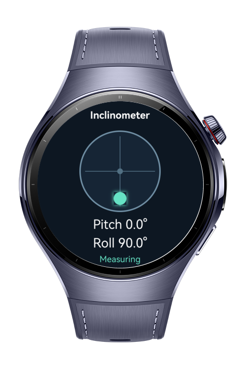

> **Note:** To access all shared projects, get information about environment setup, and view other guides, please visit [Explore-In-HMOS-Wearable Index](https://github.com/Explore-In-HMOS-Wearable/hmos-index).

# How To Implement Realtime Inclinometer

A practical realtime inclinometer sample for HarmonyOS Next smart wearables. The application combines accelerometer and gyroscope measurements with a complementary filter, displays pitch and roll in degrees, and moves a circular level indicator according to the fused angles. The codelab also demonstrates timestamp based gyroscope integration, separate sensor and UI update rates, sensor availability checks, and lifecycle aware cleanup.

# Preview

<div>
  
</div>

# Use Cases

- **Realtime Tilt Measurement**: Calculates pitch and roll continuously from accelerometer and gyroscope samples.
- **Complementary Sensor Fusion**: Combines the accelerometer's stable gravity reference with the gyroscope's smooth short term response using an initial alpha value of `0.98`.
- **Battery Aware Wearable Measurement**: Requests 50 Hz sensor sampling, limits ArkUI updates to approximately 30 Hz, and stops subscriptions as soon as the page is hidden or the application enters the background.

**Target APIs**

| Module | Method | Role |
|---|---|---|
| Sensor Service Kit | `sensor.getSensorList` | Checks whether the accelerometer and gyroscope are available |
| Sensor Service Kit | `sensor.on` | Subscribes to accelerometer and gyroscope data at a requested 20 ms interval |
| Sensor Service Kit | `sensor.off` | Stops active sensor subscriptions during cleanup |
| AccelerometerResponse | `x` / `y` / `z` | Provides the gravity vector used to calculate pitch and roll |
| GyroscopeResponse | `x` / `y` / `timestamp` | Provides angular velocity and timestamps for elapsed time integration |
| ArkUI lifecycle | `onPageShow` / `onPageHide` / `aboutToDisappear` | Starts measurement while visible and releases resources when leaving the page |

# Technology

## Stack

- **Languages**: ArkTS, ArkUI
- **Frameworks**: HarmonyOS SDK 6.0.1(21)
- **Tools**: DevEco Studio
- **Libraries & Kits**:
  - `@kit.SensorServiceKit` — Accelerometer and gyroscope discovery, subscription, and cleanup
  - `@kit.ArkUI` — Wearable interface, level indicator, and page lifecycle
  - `@kit.AbilityKit` — UIAbility lifecycle and application entry point
  - `@kit.PerformanceAnalysisKit` — Ability lifecycle diagnostics

## Required Permissions

- `ohos.permission.ACCELEROMETER` — Reads acceleration, including the gravity component.
- `ohos.permission.GYROSCOPE` — Reads angular velocity around the device axes.

# Directory Structure

```
entry/src/main/
├── ets/
│   ├── entryability/
│   │   └── EntryAbility.ets             // Main UIAbility and foreground/background handling
│   ├── model/
│   │   └── InclinometerReading.ets      // UI reading and measurement status model
│   ├── pages/
│   │   └── InclinometerPage.ets         // Level indicator, angle values, and page lifecycle
│   └── sensor/
│       ├── ComplementaryFilter.ets      // Angle initialization, integration, and sensor fusion
│       └── InclinometerController.ets   // Sensor checks, subscriptions, timing, and UI throttling
└── resources/base/
    ├── element/
    │   ├── color.json                   // UI color resources
    │   └── string.json                  // Labels, values, and status text resources
    └── profile/
        └── main_pages.json              // Application page registration
```

# Constraints and Restrictions

## Supported Device

- Huawei Watch 5 with accelerometer and gyroscope support

## Requirements

- HarmonyOS API level 21 or higher
- DevEco Studio compatible with HarmonyOS SDK 6.0.1 or later
- A physical wearable with accelerometer and gyroscope sensors
- Physical device testing for axis direction, stability, subscription errors, and lifecycle cleanup
- Previewer and emulator motion data may not represent physical device movement accurately
- Measurement runs only while the page is visible; background measurement is not supported
- Yaw, compass heading, magnetometer fusion, calibration settings, and measurement history are outside this sample's scope

# License

How to Implement Realtime Inclinometer for HarmonyOS is distributed under the terms of the [LICENSE](./LICENSE).
